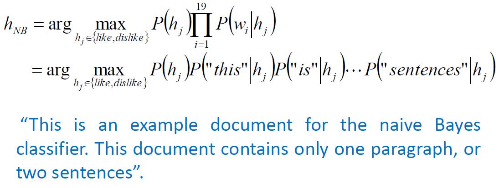

# Math

$P(A\land B)=P(A|B)P(B)=P(B|A)P(A)$

$P(A\lor B)=P(A)+P(B)-P(A\land B)$

$P(B)=\sum_{i=1}^{n}P(B|A_i)P(A_i)$

$P(h|D)=\frac{P(D,h)}{P(D)}=\frac{P(D|h)P(h)}{P(D)}$ 

* h: hypothesis

* D: Data

* $P(h|D)$: 后验概率

* $p(h)$: 先验概率

* $p(D|h)$: 条件概率

---

对于给定的训练集，首先基于特征条件独立假设学习输入输出的联合概率分布；然后基于此模型，对给定的输入 x，利用贝叶斯定理求出后验概率最大的输出 y。

$h_{MAP}=arg \max_hP(h|D)=arg \max_hP(D|h)P(h)$

因为$P(D)$是一样的，可以忽略，如果要算，用全概率公式计算$P(D)=\sum_{i=1}^nP(D|h_i)P(h_i)$。要想计算后验概率只需计算类条件概率和先验概率

 对先验概率的处理方式：

1. 所有h都给一个相同的先验概率，计算时可忽略
2. 每一类样本出现的频率代替概率

# 朴素贝叶斯

类条件概率在D维数较高时较难计算，朴素贝叶斯分类器通过假设每一维都是独立来减少运算量，但可能会因为数据的某些维度有关联，导致效果不好。

$P(D|h)=P(d_1,...,d_2|h)=\prod_iP(d_i|h)$，在朴素贝叶斯假设下，计算联合概率分布时直接连乘数据每一维的概率。在非朴素贝叶斯前提下，计算时要考虑他的分布如高斯。

改进方法：

* 贝叶斯信念网络(BBN）-假设某些维度存在关联
* 高斯混合模型

## 文本分类

在文本分类场景下，$h$是文本类别，最终是根据后验概率大小决定是哪一类文本。

### Learning

#### 先验概率：

可以用已有知识或者用每一类样本出现频率代替。

#### 条件概率：

我们用每个位置出现的单词的概率来分析文本，如有like, dislike两类，每个文本19个单词，词汇表中总共有5000个单词，则总共需要计算2x19x5000个概率，太复杂了，因此我们不考虑单词的位置，只考虑单词的统计个数。

$P(w_i|h_j)=n_i^j/n_j$，hj类中wi单词出现的概率 = wi单词在hj类中出现的次数 除以 这一类文本的单词数量

但实际应用时我们不用上述公式计算类条件概率，而是用下式：

$P(w_i|h_j)=(n_j^i+1)/(n_j+|Vocabulary|)$

因为某些单词如果在训练集中没有出现，那么他的概率为0，会导致整个后验概率为0，因此在分子加1，在分母加整个词汇大小

### 分类


### 以20Newsgroups为数据集进行朴素贝叶斯分类器的训练与测试

#### 训练过程

得到Vocabulary

​		把所有文档单词拿出来，但要过滤掉重复的单词

计算先验概率$p(h_j)$和类条件概率$P(w_i|h_j)$（此处共20类，i=Vocabulary大小）

​		for each target value $h_i$ in H

​				把所有hi类的文章拿出来，构成一个子集=$artics_j$

​				$P(h_j)=\frac{|artics_j|}{|Training data|}$ # 计算每一类的先验概率

​				计算$artics_j$中总单词个数$n_j$

​				for each word $w_i$ in Vocabulary # 计算每个单词$w_i$的类条件概率

​						计算$artics_j$类文档中$w_i$单词出现的次数=$n_j^i$

​						$P(w_i|h_j)=\frac{n_j^i+1}{n_j+|Vocabulary|}$ # 在j类文档中wi的类条件概率

### 测试过程

$h_{NB}=argmax_{h_j\in H}P(h_j)\prod_{i=1}^{N}P(w_i|h_j)$

概率值最大的类对应文章的类别

### 代码实现

#### 用Sklearn中自带的贝叶斯分类器实现

```python
from sklearn.feature_extraction.text import TfidfVectorizer

tf = TfidfVectorizer()
x_train = tf.fit_transform(x_train)
x_test = tf.transform(x_test)

from sklearn.naive_bayes import MultinomialNB

bayes = MultinomialNB(alpha = 1.0)
bayes.fit(x_train, y_train)
import numpy as np
y_predict = bayes.predict(x_test)
y_predict = np.array(y_predict)
print("预测文章的类型：", y_predict)
print("The accuracy: ", bayes.score(x_test, y_test))
```

#### 自己的实现

导入数据

```python
from sklearn.datasets import fetch_20newsgroups # 导入sklearn package
news = fetch_20newsgroups(subset="all")
```

划分训练集与测试集

```python
from sklearn.model_selection import train_test_split
x_train, x_test, y_train, y_test = train_test_split(news.data, news.target, test_size=0.25) # 划分训练集与测试集
```

数据预处理

创建wordlist

* 全部转化为小写
* 去掉标点符号
* 去掉换行符
* 将数据以空格划分

```python
import string
from collections import Counter
table = str.maketrans(dict.fromkeys(string.punctuation))

word_set = set()
counter_per_cat = [Counter() for i in range(len(news.target_names))]  # 创建文章类别个数的Counter()，计算每个单词在所有文档类别出现的频率 
for sample_id, sample in enumerate(x_train):
    sample_label = y_train[sample_id]
    words = str(sample).lower().translate(table).strip().split()#lower()转化为小写 translate()去掉标点符号 strip()去掉换行符 split()将数据以空格划分
    counter_per_cat[sample_label].update(words)
    word_set.update(words)
word_list = list(word_set)
```

#### Classifier learning

* prob_mat: 类条件概率
  * size of[label_num（类别数）, word_num（Vocabulary大小）]
  * 类条件概率
* Get expected statistics from the training data
  * total_freq : total word frequency in articles with certain label（具有特定标签的文章的总词频）
  * label_prob : the class prior probabilities of training data（先验概率）
  * empty_prob : for word doesn’t appear in training data（处理没有出现在训练数据中的词）
  * prob_mat : probability of each word appears in each article label
* Use these statistics to classify articles in the test data

```python
total_freq = [] # 每类文章的总词频：nj
label_prob = [] # 先验概率
empty_prob = [] # 没有出现在训练数据中的词
prior_prob = Counter(y_train)
for label_id, label in enumerate(news.target_names):
    total_freq.append(sum(counter_per_cat[label_id].values())) # 每类文章的总词频：nj
    label_prob.append(prior_prob[label_id]/len(y_train)) # 先验概率
    empty_prob.append((1)/(total_freq[label_id] + len(word_list))) # 没有出现在训练数据中的词

import numpy as np
prob_mat = np.zeros((len(news.target_names), len(word_set))) # 类条件概率
for label_id, label in enumerate(news.target_names):
    freq_list = counter_per_cat[label_id]
    for word_id, word in enumerate(word_set):
        if word not in freq_list:
            freq_label = 0
        else:
            freq_label = freq_list[word]
        freq_all = total_freq[label_id]
        prob = (freq_label + 1) / (freq_all + len(word_set)) # 计算类条件概率
        prob_mat[label_id, word_id] = prob
```

#### News article classification

* The steps for testing:
  * Tokenize the articles in test data (数据预处理)
  * Calculate the probability of the article belongs to each label（计算文章属于每一类的概率）
  * Classify it with the highest one（将文章分类为上面计算概率最大的类）
* Issue:
  * To avoid the product of probabilities getting too close to0, we use log likelihood equation: Convert product to addition

```python
import math
from tqdm import tqdm
label_prob = np.log(np.array(label_prob))
empty_prob = np.log(np.array(empty_prob))
prob_mat = np.log(np.array(prob_mat))
predict_labels = np.zeros(len(x_test), dtype = int)
for sample_id, sample in tqdm(enumerate(x_test), total = len(x_test)):
    probs = np.zeros(len(news.target_names))
    words = str(sample).lower().translate(table).strip().split() # Tokenize
    sample_len = len(words)
    word_freq = Counter(words)
    words = list(set(words).intersection(set(word_list))) # 返回words和word_list的交集
    for label_id, label in enumerate(news.target_names): # Calculate the probality for each category
        prob_label = label_prob[label_id]
        len_a = 0
        for word in words:
            word_id = word_list.index(word)
            prob_cur = prob_mat[label_id, word_id]
            prob_label += word_freq[word] * (prob_cur)
            len_a += word_freq[word]
        len_b = sample_len - len_a
        if len_b > 0:
            prob_label += len_b * (empty_prob[label_id])
        probs[label_id] = prob_label
    predict_label = np.argmax(probs) # Category with the highest probality
    predict_labels[sample_id] = predict_label
```

#### Results

* Calculate the accuracy of the prediction among all of the categories

```python
# accuracy of the prediction among all of the categories
comp = predict_labels - np.array(y_test)
accuracy = (len(np.where(comp == 0)[0])) / len(x_test)
print(accuracy)

# Detailed accuracy
y_test = np.array(y_test)
for i in range(len(news.target_names)):
    cat_data_num = (np.where(y_test == i))[0].shape[0]
    pred_cat_tmp = predict_labels[np.where(y_test == i)]
    pred_correct = np.where(pred_cat_tmp == i)[0].shape[0]
    accuracy_per_cat = pred_correct/cat_data_num
    print(news.target_names[i])
    print("total data number of this category: " + str(cat_data_num))
    print("number of correctly prediction: " + str(pred_correct))
    print("predicition accuracy for this category: " + str(accuracy_per_cat))
```
